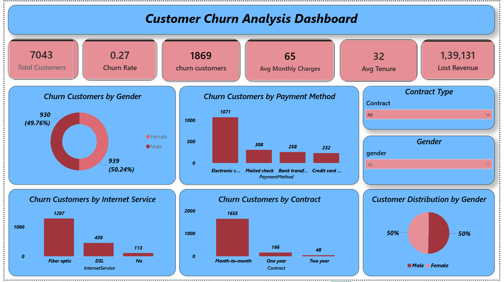
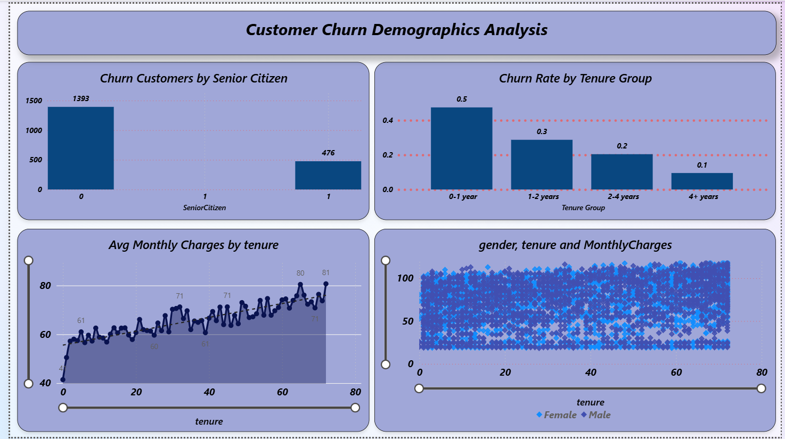
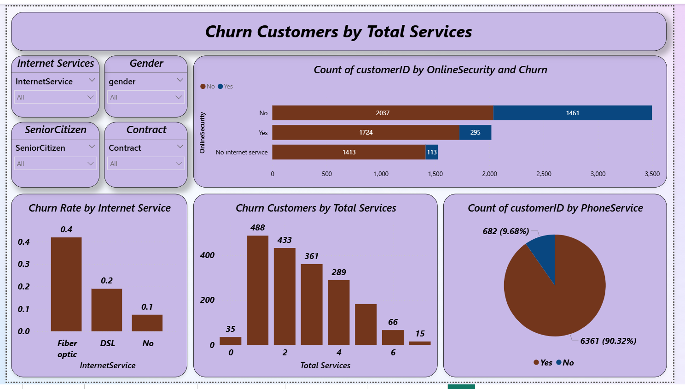
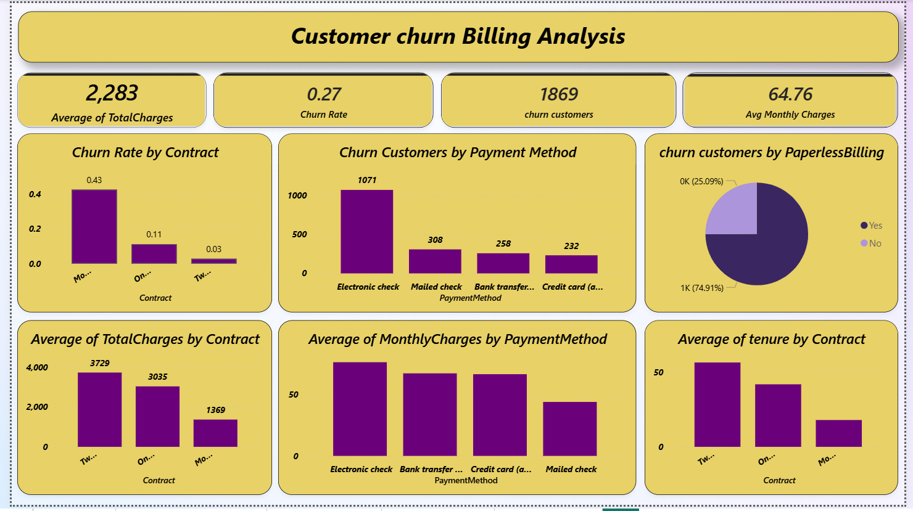

# 📊 Customer Churn Analysis using Power BI

## 🚀 Overview

This project presents a **Customer Churn Analysis Dashboard** built using Power BI to analyze customer behavior and identify key factors influencing churn in a telecom company.

The goal is to help businesses improve **customer retention** through data-driven insights.

---

## 🎯 Objectives

* Analyze customer demographics
* Identify churn patterns
* Study impact of contract types and services
* Provide actionable business insights

---

## 🛠️ Tools & Technologies

* Power BI
* DAX (Data Analysis Expressions)
* Excel / CSV

---

## 📊 Dashboard Features

### 🔹 Overview

* Total Customers
* Churn Rate
* KPI indicators

### 🔹 Demographics Analysis

* Churn by Gender
* Senior Citizen impact
* Partner/Dependents

### 🔹 Service & Contract Analysis

* Contract type vs churn
* Internet services impact

### 🔹 Billing Analysis

* Monthly charges vs churn
* Payment method insights

---

## 📈 Key Insights

* Month-to-month contracts have the highest churn
* Higher monthly charges increase churn probability
* Customers with longer tenure are more loyal

---

## 📸 Dashboard Preview

### Overview



### Demographic Analysis



### Sevice Analysis



### Billing Analysis



---

## 📁 Project Structure

```bash
customer-churn-analysis-powerbi/
├── data/
├── dashboards/
├── screenshots/
└── README.md
```

---

## 💼 Business Impact

* Helps reduce customer churn
* Improves retention strategies
* Supports data-driven decision making

---

## 👤 Author

**V Sharanya**

* 💼 Data Analyst
* 📍 Hyderabad,India

---

## 🔗 Connect With Me

* LinkedIn: https://www.linkedin.com/in/sharanya-sharanya/
* GitHub: https://github.com/sharanya-veerapeta

---

## ⭐ If you found this useful, give it a star!
